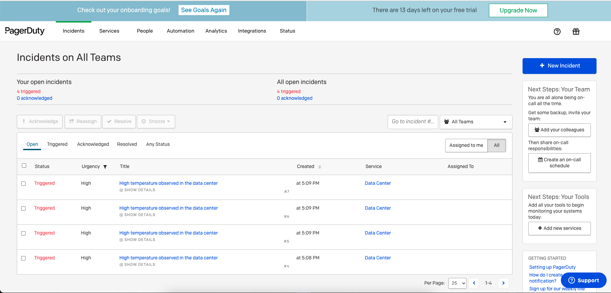

# Infrastructure Monitoring and Alerting with Materialize

## Step 1: Setup the infrastructure services

Clone the repo and spin up the containers with Docker Compose.

```console
git clone https://github.com/dunithd/edu-samples.git
cd edu-samples/mz_alerts
docker-compose up -d kafka zookeeper schema-registry materialized
```

## Step 2: Create a source, views, and a sink in Materialize

Bring up the `mzcli` that you can use as a CLI to Materialized.

```console
docker run -it --network mz_alerts_default materialize/mzcli mzcli -h materialized -U materialize -p 6875 -d materialize
```

Copy and paste the contents in the materialize.sql file into `mzcli` console.

```sql
CREATE SOURCE sensor_data_raw
FROM PUBNUB
SUBSCRIBE KEY 'sub-c-5f1b7c8e-fbee-11e3-aa40-02ee2ddab7fe'
CHANNEL 'pubnub-sensor-network';

CREATE VIEW sensor_data AS
SELECT
    ((text::jsonb)->>'sensor_uuid') AS sensor_uuid,
    ((text::jsonb)->>'ambient_temperature')::float AS ambient_temperature,
    ((text::jsonb)->>'radiation_level')::int AS radiation_level,
    ((text::jsonb)->>'humidity')::float AS humidity,
    ((text::jsonb)->>'photosensor')::float AS photosensor,
    to_timestamp(((text::jsonb)->'timestamp')::bigint) AS ts
FROM sensor_data_raw;

CREATE MATERIALIZED VIEW anomalies AS
SELECT sensor_uuid,
       AVG(ambient_temperature) AS avg
FROM sensor_data
WHERE EXTRACT(EPOCH FROM (ts + INTERVAL '5 seconds'))::bigint * 1000 > mz_logical_timestamp()
GROUP BY sensor_uuid
HAVING AVG(ambient_temperature) > 40;

CREATE SINK alerts
FROM anomalies
INTO KAFKA BROKER 'kafka:9092' TOPIC 'high-temp-alerts'
    CONSISTENCY TOPIC 'high-temp-alerts-consistency'
    CONSISTENCY FORMAT AVRO USING CONFLUENT SCHEMA REGISTRY 'http://schema-registry:8081'
WITH (reuse_topic=true)
FORMAT JSON;
```

## Step 3: Configure PageDuty

Configure PagerDuty as explained in the article. 

## Step 4: Configure and run Python consumer

Run the following in the Materialize CLI.

```sql
SELECT sink_id, name, topic
 FROM mz_sinks
 JOIN mz_kafka_sinks ON mz_sinks.id = mz_kafka_sinks.sink_id
```

Find out the Kafka topic name from the `topic` field in the result.

Copy that value to replace the value of the alerts_topic variable inside `pagerduty-client/pd_client.py`

```python
alerts_topic = "high-temp-alerts-u5-XXXXXX"
```

Replace all PagerDuty related placeholders in the same script.

Finall, build and run Python consumer container by running:

```console
docker-compose up -d pagerduty-client
```

## Step 5: Log in to PagerDuty console to see the triggered incidents

If eveything goes well, you should see a screen like this:



### Troubleshooting

If you don't see anything in PagerDuty, then there's something wrong with the Python script.

To isolate that the issue is related to Python consumer, run the following:

```console
docker-compose exec kafka kafka-console-consumer --bootstrap-server kafka:9092 --topic high-temp-alerts-u5-1631586083-13100517045407420899
```

If you see an output like this, that means Materialize is working as expected as writes alerts into Kafka topic.

```console
{"after":{"row":{"avg":41.799999952316284,"sensor_uuid":"probe-becc8842"}},"before":null,"transaction":{"id":"1631586809000"}}
{"after":null,"before":{"row":{"avg":41.799999952316284,"sensor_uuid":"probe-becc8842"}},"transaction":{"id":"1631586813000"}}
```

That confirms the fault is with the Python consumer. Check for PagerDuty credentials, network connections for more insights.
