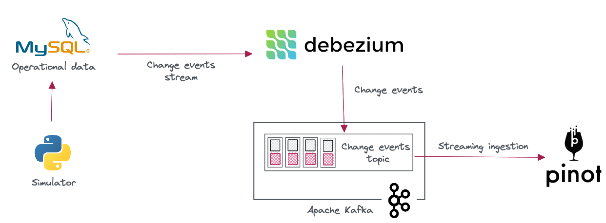
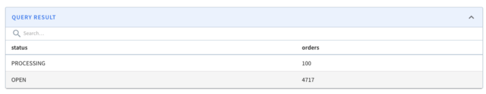

# Cheat sheet #

The project mimics an online e-commerce store with MySQL as the transactional database. E-commerce orders are captured in the orders MySQL table.

When an order goes through its lifecycle stages, the status field should transition from OPEN to PROCESSING to SHIPPED.

The goal is to capture the changes made to the orders table in MySQL and ship them into Apache Pinot so that we can run real-time analytics on orders.

We will use Debezium and Apache Kafka to build this real-time data pipeline. Debezium captures the changes made to the orders table and streams them into Kafka, allowing Pinot to ingest them in real-time.



## 1. Start the stack

In a terminal, type the following to start the entire Docker compose stack.

```bash
docker compose up -d
```

Wait for like a minute to get the entire solution up and running. 

## 2. Create the orders schema and table in Pinot

Execute the following to create the `orders` schema and table inside Apache Pinot.

```bash
docker exec -it pinot-controller /opt/pinot/bin/pinot-admin.sh AddTable \
-tableConfigFile /config/orders_table.json \
-schemaFile /config/orders_schema.json -exec
```

Login to the Pinot query console on localhost:9000 and verify that the `orders` table is getting populated with incoming orders.

## 3. Manually change the order status in MySQL

Execute the following command in a terminal to log into the MySQL container.

```bash
docker exec -it mysql /bin/bash
mysql -u mysqluser -p
mysqlpw
use fakeshop;
```

Let's update the first 100 orders to have the PROCESSING status. Note that the order id is set to increase sequentially from 1.

```sql
UPDATE orders
SET    status = 'PROCESSING'
WHERE  id <= 100;
```

Run the following query to ensure that we can see orders with two statuses.

```sql
SELECT status        AS status,
       Count(status) AS orders
FROM   orders
GROUP  BY status;
```

## 4. Verify the status change in Apache Pinot

After a few seconds, run the following query in the Pinot query console. You should see the 100 orders with the PROCESSING status.

```sql
SELECT payload.status        AS status,
       Count(payload.status) AS orders
FROM   orders
GROUP  BY payload.status
```
That will result in the following:



## 5. Tear down the stack

Run the following command to tear down the stack.

```bash
docker compose down
```
